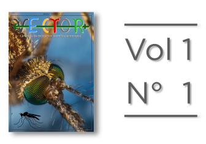

#### Contenidos
##### [Revista Vector](#revista-vector)
##### [Podcasts](#podcasts)
---

# Revista Vector

## La revista de divulgación científica y tecnológica Argentina.

Volumen 1

Números:
###### 
#### (Para leer y descargar tocá la portada o entrá por [acá](https://drive.google.com/file/d/1rPdOwJV2BwTmLj3W-jcYHi2TNaSbEXGY/view?usp=sharing).)
Proximamente...
---

# Podcasts
Proximamente...
---
### Sobre la iniciativa y el equipo:

Revista Vector es una iniciativa didáctica con el fin de dinamizar la relación entre la sociedad y el mundo de la investigación. Queremos comunicar el desarrollo científico y tecnológico del país de forma rigurosa y comprensible. Soñamos con llegar a ser referentes en comunicación científica para estudiantes, periodistas, políticos y ciudadanos.

---
# La Revista Vector es de libre acceso y gratuita.
### Lista para disfrutar. Atte.: Equipo Revista Vector

---
Volver al inicio: [**Contenidos**](#contenidos)
