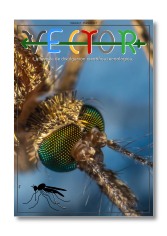

# Revista Vector

## La revista de divulgación científica y tecnológica.

Volumen 1

Números:

######  N° 1 - [La ciencia de la pandemia](https://drive.google.com/file/d/1rPdOwJV2BwTmLj3W-jcYHi2TNaSbEXGY/view?usp=sharing).

### Sobre la iniciativa y el equipo:

Revista Vector es una iniciativa didáctica con el fin de dinamizar la relación entre la sociedad y el mundo de la investigación. Queremos comunicar el desarrollo científico y tecnológico del país de forma rigurosa y comprensible. Soñamos con llegar a ser referentes en comunicación científica para estudiantes, periodistas, políticos y ciudadanos.
